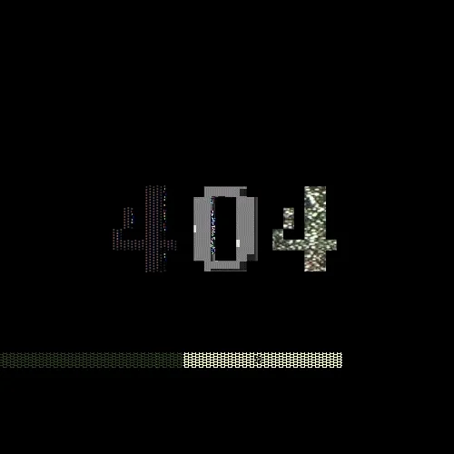
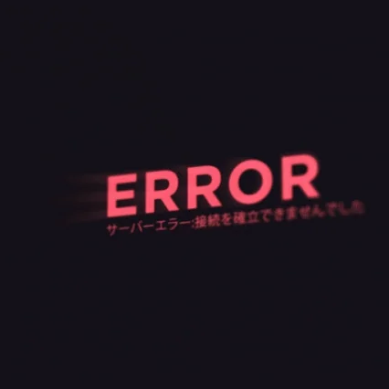

 

  

 

  

    
    
  

  
   

  

    
  

---

<h1 align="center">Hey, I'm Ricky Barlovinto ⚡</h1>

<h3 align="center">💻 Developer | 🚀 Builder</h3>

## ⚙️ Tech Stack

---

## 🧠 About Me
- 🔭 Building: Web & Mobile Applications  
- 🌱 Learning: Full Stack Development & AI Systems  
- ⚡ Focus: Clean architecture + scalable systems  

---

## 📊 GitHub Activity

### 📈 Contribution Graph

---

### 📅 Contribution Summary

---

## 🐍 Contribution Snake

---

## 🔗 Connect With Me

---

## ⚡ Philosophy
> “Build. Break. Improve. Repeat.”

---

  

